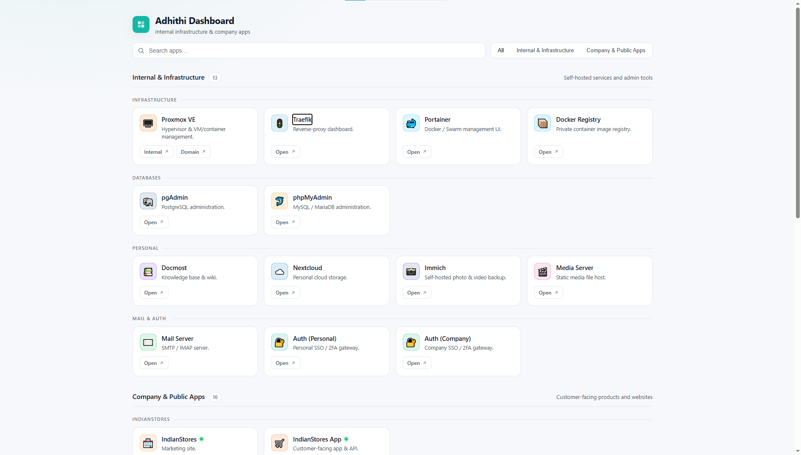

# appdash

A small, fast, **JSON-driven static dashboard** for self-hosted apps. No
build step, no framework, no database — just an HTML/CSS/JS bundle served
by Caddy that reads a single `apps.json` file.

- **Two URLs per app** — show an internal IP *and* a public domain
  side-by-side (e.g. Proxmox at `192.168.1.2:8006` and `pve.example.com`).
- **Categories with sub-groups** — top-level filter pills (Internal /
  Company / whatever you define) plus an optional `group` field that
  clusters related apps under a subheading (e.g. all "TillTech" apps
  together).
- **Live status badges** — direct fetch where CORS allows, an opt-in
  Caddy reverse-proxy fallback for the rest, or a low-noise
  `noCors` mode that just checks reachability.
- **No build tooling** — vanilla JS + custom CSS. Edit `apps.json`,
  refresh, done.
- **Tiny image** — `caddy:2-alpine` + ~30 KB of static files (~50 MB).



## Quick start

The image is published on Docker Hub as
[`msnishanth/adddash`](https://hub.docker.com/r/msnishanth/adddash).

### One-liner (no config file)

```bash
docker run -d --name appdash -p 8080:80 msnishanth/adddash:latest
```

Open http://localhost:8080. The container ships with a sample
`apps.example.json`-style config so you can see the layout immediately.

### With your own config (recommended)

```bash
git clone https://github.com/msnisha/appdash.git
cd appdash

# Copy the example and edit it for your apps
cp public/apps.example.json public/apps.json
$EDITOR public/apps.json

docker compose up -d
# → http://localhost:8080
```

The shipped `docker-compose.yml` already pulls `msnishanth/adddash:latest`
and bind-mounts `./public/apps.json` read-only, so edits on the host
appear after a browser refresh — no rebuild needed.

### Sample `docker-compose.yml`

```yaml
services:
  appdash:
    image: msnishanth/adddash:latest
    container_name: appdash
    restart: unless-stopped
    ports:
      - "8080:80"
    volumes:
      - ./apps.json:/srv/apps.json:ro
      # Optional: override Caddyfile to enable /healthproxy/* routes.
      # - ./Caddyfile:/etc/caddy/Caddyfile:ro
```

For production, drop the `ports:` block and put the container behind
your existing reverse proxy (Traefik, Caddy, nginx, Cloudflare Tunnel).
The container only listens on plain HTTP `:80` — TLS is the proxy's job.

## Configuring apps

`apps.json` is the only file you need to edit. Schema:

```jsonc
{
  "title": "My Homelab",
  "subtitle": "Self-hosted services",
  "brand": {
    "gradient": "#14b8a6"                    // any CSS color or gradient
    // "initial": "H",                       // overrides the default SVG mark
    // "logoUrl": "/my-logo.svg"             // overrides everything above
  },
  "repoUrl": "https://github.com/msnisha/appdash",

  "categories": [
    { "id": "infra",   "name": "Infrastructure", "description": "..." },
    { "id": "company", "name": "Company Apps" }
  ],

  "apps": [
    {
      "id": "proxmox",
      "name": "Proxmox VE",
      "category": "infra",                   // matches one of the category ids
      "group": "Hypervisors",                // optional — subheading within the category
      "description": "Hypervisor & VM management.",
      "icon": "🖥️",                          // emoji, single char, or "img:<url>"
      "color": "#e57000",                    // tints the icon tile
      "urls": [
        { "label": "Internal", "url": "https://192.168.1.10:8006" },
        { "label": "Domain",   "url": "https://pve.example.com" }
      ],
      "health": {                            // optional, see "Health checks"
        "url": "/healthproxy/proxmox/api2/json/version",
        "expect": [200, 401]
      }
    }
  ]
}
```

See [`public/apps.example.json`](public/apps.example.json) for working
examples covering single URL, two URLs, image icons, and all three
health-check modes.

## Sub-groups

Top-level **categories** become filter pills. Within each category, apps
with the same `group` value get clustered under a small uppercase
subheading. The order of the subheading is determined by the first app
that uses that group, so you control the layout via JSON ordering alone.

```jsonc
"apps": [
  { "id": "tilltech-marketing", "category": "company", "group": "TillTech", ... },
  { "id": "tilltech-app",       "category": "company", "group": "TillTech", ... },
  { "id": "tilltech-kds",       "category": "company", "group": "TillTech", ... },
  { "id": "kidsweb",            "category": "company", "group": "Kidsweb",  ... },
  { "id": "filebrowser",        "category": "company", "group": "Kidsweb",  ... }
]
```

Renders as:

```
Company Apps
── TILLTECH ─────────────────────────
[Marketing]  [Backoffice]  [KDS]
── KIDSWEB ──────────────────────────
[Kidsweb]    [FileBrowser]
```

The `group` field is **optional** — apps without one render flat at the
top of their category, no subheading. Mix and match freely.

## Health checks

The frontend tries to fetch `health.url` for each app and toggles the
status dot accordingly. Three modes, in increasing reliability:

| Mode | Tells you | Use when |
| ---- | --------- | -------- |
| **`noCors: true`** | Reachable, status unknown | Default for any cross-origin app without CORS — zero setup |
| **CORS direct** with `expect: [...]` | Real HTTP status code | App returns `Access-Control-Allow-Origin` |
| **proxy** — `health.url` is a path like `/healthproxy/<id>/...` | Real HTTP status code, no CORS issue | Internal apps you don't want to expose CORS for |

```jsonc
// Easiest — works for any URL
"health": { "url": "https://app.example.com", "noCors": true }

// Most accurate — needs CORS on the upstream
"health": {
  "url": "https://app.example.com/api/ping",
  "expect": [200]
}

// Best for internal apps — bypasses CORS via Caddy reverse-proxy
"health": {
  "url": "/healthproxy/myapp/health",
  "expect": [200, 401, 403]
}
```

For proxy mode, uncomment a `handle_path` block in
[`Caddyfile`](Caddyfile) and bind-mount your edited copy. Caddy
reverse-proxies the upstream so the browser sees a same-origin response.

```caddy
handle_path /healthproxy/proxmox/* {
    reverse_proxy https://192.168.1.10:8006 {
        transport http {
            tls
            tls_insecure_skip_verify
        }
    }
}
```

Checks re-run every 60 s. A request times out after 4 s.

### Heads-up: apps behind OAuth proxies

If you use a forward-auth middleware (e.g. `traefik-forward-auth`,
`oauth2-proxy`) in front of internal apps, **don't add a `health` block
to those apps**. The fetch will follow the redirect chain to your
identity provider (Google, GitHub, etc.) which will respond with `403`
and pollute the browser network log. Either:

- Leave `health` off — the card still renders normally, just without a
  status dot.
- Use proxy mode against an unauthenticated upstream path (e.g. directly
  to the container, bypassing the auth middleware).

## Files

```
appdash/
├── public/
│   ├── index.html              # markup
│   ├── styles.css              # custom dark theme, ~280 lines
│   ├── app.js                  # vanilla JS renderer + health checks
│   ├── logo.svg                # default brand mark + favicon
│   ├── apps.json               # YOUR config (gitignored)
│   └── apps.example.json       # reference config (committed)
├── Caddyfile                   # serves /srv on :80, opt-in /healthproxy
├── Dockerfile                  # caddy:2-alpine + COPY public /srv
├── docker-compose.yml          # uses msnishanth/adddash:latest
├── LICENSE                     # MIT
└── .gitignore                  # ignores public/apps.json
```

`apps.json` is **gitignored** so you can keep your real infrastructure
list private when forking. `apps.example.json` is committed and serves
as the schema reference / starter template.

## Customising the look

Theme variables live at the top of `public/styles.css`. Override
`--accent`, `--bg`, `--bg-card`, etc. there. The dashboard auto-switches
to a light theme based on `prefers-color-scheme`.

The default brand mark is a 4-tile SVG in `public/logo.svg`. To change
it, either:

- Edit `logo.svg` directly (used as both favicon and the in-page logo).
- Or set `brand.logoUrl` in `apps.json` to your own image path.
- Or set `brand.initial` to fall back to a one-letter mark.

## Why custom CSS instead of Tailwind?

Zero dependencies, no CDN call, no build pipeline. The whole frontend is
four files totalling under 35 KB unminified.

## License

MIT — see [LICENSE](LICENSE).
